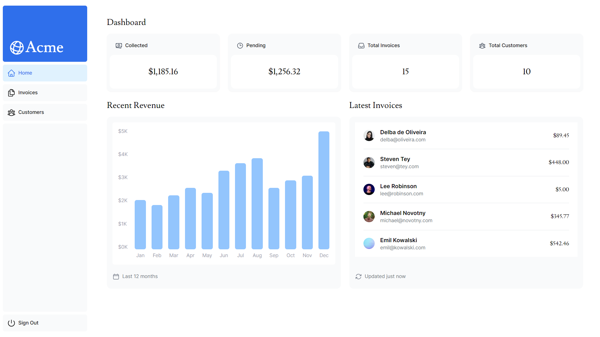

# ACME Dashboard | Next.js (App Router)

> ACME Dashboard web app built with Next.js and TypeScript.



Invoice dashboard built with Next.js and TypeScript. Auth.js for Authentication.

<!-- toc -->

- [Features](#features)
- [Usage](#usage)
  - [Env Variables](#env-variables)
  - [Install Dependencies](#install-dependencies)
  - [Seed Database](#seed-database)
  - [Run](#run)

<!-- tocstop -->

## Features

- User authentication
- Dashboard page to manage invoices & customers
- Search & Pagination
- CRUD (create, read, update, delete) invoices

## Usage

- You should have Node.js installed [Node.js](https://nodejs.org/)
- Vercel to deploy and SQL database [Vercel](https://www.vercel.com/)

### Env Variables

Rename `.env.example` to `.env` and add your env variables

### Install Dependencies

```
npm install
```

### Seed Database

```
npm run seed
```

### Run

```
npm run dev
```
